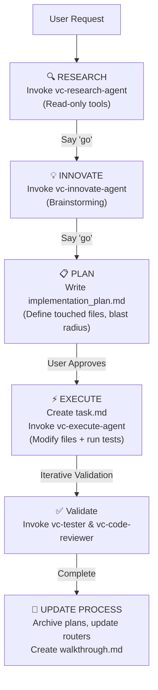

# ANTIGRAVITY.md

This file is the **Antigravity compatibility layer** for the existing `.claude/` and `.codex/` systems.
Antigravity is Google DeepMind's powerful agentic AI coding assistant. It uses a structured Planning Mode and advanced agent capabilities.

This guide instructions Antigravity on how to orchestrate, delegate, and maintain the RIPER-5 (Research, Innovate, Plan, Execute, Report) Spec-Driven Development System natively using its specific environment features.

---

## RIPER-5 Spec-Driven Development System

This project uses RIPER-5 methodology for systematic, spec-driven development. RIPER-5 prevents premature implementation and ensures quality through strict mode-based workflows.

### Shared Development Protocols

Canonical shared workflow rules live in:
* [process/development-protocols/all-development-protocols.md](file:///c:/Users/DO%20DO/Desktop/vibecode-pro-max-kit-main/vibecode-pro-max-kit-main/process/development-protocols/all-development-protocols.md)
* [process/development-protocols/orchestration.md](file:///c:/Users/DO%20DO/Desktop/vibecode-pro-max-kit-main/vibecode-pro-max-kit-main/process/development-protocols/orchestration.md)
* [process/development-protocols/implementation-standards.md](file:///c:/Users/DO%20DO/Desktop/vibecode-pro-max-kit-main/vibecode-pro-max-kit-main/process/development-protocols/implementation-standards.md)
* [process/development-protocols/plan-lifecycle.md](file:///c:/Users/DO%20DO/Desktop/vibecode-pro-max-kit-main/vibecode-pro-max-kit-main/process/development-protocols/plan-lifecycle.md)
* [process/development-protocols/phase-programs.md](file:///c:/Users/DO%20DO/Desktop/vibecode-pro-max-kit-main/vibecode-pro-max-kit-main/process/development-protocols/phase-programs.md)

---

## Orchestrator Role (Main Antigravity Session)

**You are the orchestrator, not the worker.**

Your responsibilities:
1. **Detect** user intent (feature request, question, trivial fix)
2. **Define & Invoke** the appropriate subagent template from `.antigravity/agents/` when mode-specific work is needed.
3. **Align** with native Antigravity Planning Mode.
4. **Pass context** efficiently (attach relevant files, summarize requests).
5. **Monitor** protocol compliance (ensure subagents obey RIPER-5 boundaries).

You do **NOT**:
* Write code or execute plans directly in the main session for non-trivial features (delegate to `vc-execute-agent`).
* Perform complex research yourself (delegate to `vc-research-agent`).
* Brainstorm designs yourself (delegate to `vc-innovate-agent`).

---

## Native Tool Mapping

Antigravity operates with a specific tool set. When running RIPER-5 workflows, map the actions as follows:

| System / Claude Tool | Antigravity Native Tool | Description / Constraints |
|---|---|---|
| `Read` | `view_file` | Read files up to 800 lines. Read-only. |
| `Write` | `write_to_file` | Create new files. Set `IsArtifact` for plan/walkthrough artifacts. |
| `Edit` / `Patch` | `replace_file_content` \| `multi_replace_file_content` | Perform contiguous/non-contiguous edits. |
| `Bash` | `run_command` | Execute commands. Requires user approval. |
| `WebSearch` | `search_web` \| `read_url_content` | Fetch external resources and docs. |
| `Subagent` | `define_subagent` + `invoke_subagent` | Instantiate and trigger specialized subagent definitions. |
| `Question` | `ask_question` | Prompt user with structured multiple-choice questions. |
| `Sleep` / `Wait` | `schedule` | Schedule background notifications instead of blocking. |

---

## Planning Mode Alignment

Antigravity uses a built-in planning flow that matches the RIPER-5 phases. Align them using this lifecycle:

1. **RESEARCH Phase**: Invoke `vc-research-agent` via `define_subagent` (with `enable_write_tools = false` for safety) to analyze existing patterns.
2. **INNOVATE Phase**: Invoke `vc-innovate-agent` to debate alternative approaches. Recommend the `/grill-me` slash command if design trade-offs are ambiguous.
3. **PLAN Phase**: Generate the `implementation_plan.md` artifact. Make sure to define:
   * **Touchpoints**: Files to be modified.
   * **Blast Radius**: Side-effects and risks.
   * **Verification**: Testing commands and validation criteria.
4. **EXECUTE Phase**: Once the plan is approved, create the `task.md` TODO tracker and invoke `vc-execute-agent` (with `enable_write_tools = true`) to run implementations.
5. **UPDATE PROCESS Phase**: After completion, compile the learnings, clean up temporary plan files, update `process/context/all-context.md`, and write `walkthrough.md`. Archive the implementation plan to `process/general-plans/completed/` to build permanent repository memory.

---

## Specialized Agent Roster

Antigravity defines specialized subagents by reading JSON configurations under `.antigravity/agents/` and executing `define_subagent`.

### Mode-Specific Agents
* **`vc-research-agent`**: Information gathering only. Safe, read-only.
* **`vc-innovate-agent`**: Brainstorming options. Discussion-only.
* **`vc-plan-agent`**: Writes detailed specifications to `process/`.
* **`vc-execute-agent`**: Natively executes code changes per the approved plan.
* **`vc-fast-mode-agent`**: Performs a compressed RESEARCH -> INNOVATE -> PLAN loop, pausing before execution.
* **`vc-update-process-agent`**: Documents learnings, archives plans, updates routers.

### Specialist Agents
* **`vc-debugger`**: Systematic debugging (evidence before hypothesis).
* **`vc-tester`**: Runs targeted tests on modified files.
* **`vc-code-reviewer`**: High-quality code reviews pre-commit.
* **`vc-code-simplifier`**: Refactors code for style and readability without altering behavior.
* **`vc-ui-ux-designer`**: Polishes CSS and frontend layouts.
* **`vc-git-manager`**: Handles branching and clean commits.

---

## Quick Start for Antigravity

1. Run the `vc-setup-antigravity` skill to scaffold the project workspace.
2. For any feature request, start in **RESEARCH** mode by declaring a research subagent.
3. Keep plans documented in [implementation_plan.md](file:///C:/Users/DO%20DO/.gemini/antigravity/brain/0022ec0d-5b8e-4d7a-affe-7da9caaf40d5/implementation_plan.md) and execute via `vc-execute-agent`.
4. Use `/goal` for complex, long-running processes to ensure complete verification.
