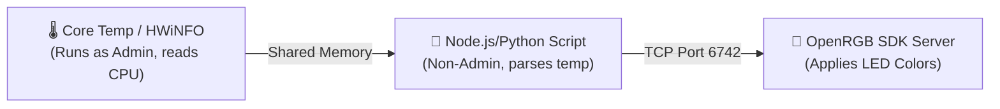

# OpenRGB CPU Temperature Sync Implementation Plan (Revised)

This plan details how to resolve the `0.000000` CPU temperature reading in OpenRGB and establish the lighting synchronization.

---

## Technical Analysis of the "0.000000" Value

Under Windows, accessing CPU core registers (like Ryzen Tctl/Tdie) to read temperatures requires kernel-level hardware access. OpenRGB uses the embedded `LHWM.sys` (LibreHardwareMonitor) driver to achieve this.

If the value is stuck at `0.000000`, the causes are:
1. **Lack of Administrator Privileges (Most Common):** If OpenRGB is launched as a standard user, Windows blocks it from loading the kernel-mode driver, resulting in a silent failure where the sensor value defaults to `0.000000`.
2. **Driver Conflict:** If another hardware monitoring tool (such as HWInfo64, AIDA64, or Ryzen Master) is running with exclusive locks on the sensors, the plugin driver fails to initialize.

---

## User Review Required

Please execute the following steps to verify if we can resolve **Option A (Native Plugin)**:

### Verification Steps for Option A (Run as Administrator)
1. **Exit OpenRGB completely:** Right-click the OpenRGB icon in the Windows system tray and select **"Quit"** (ensure no background instances are running).
2. **Relaunch as Administrator:** 
   - Open File Explorer and navigate to `C:\Program Files\OpenRGB`.
   - Right-click `OpenRGB.exe` and select **"Run as administrator"**.
3. **Verify the sensor reading:** Navigate back to the "Hardware Sync" tab. Click the dropdowns to reselect **AMD Ryzen 7 5800X** and **Core (Tctl/Tdie)**. Check if the `Measure value` changes from `0.000000` to your actual CPU temperature (e.g., `45.500000`).

---

## Backup Plan: Option B (Custom SDK Script via Core Temp / HWiNFO)

If running OpenRGB as Administrator does **not** resolve the sensor reading (due to a driver compatibility block with your specific motherboard/CPU combination), we will implement a custom scripting bridge:

### Proposed Changes for Option B:
1. **Core Temp Bridge:** We will ask you to run [Core Temp](https://www.alcpu.com/CoreTemp/) (a lightweight, highly compatible CPU monitor) in the background. Core Temp runs as admin and exposes real-time temperature data through a shared memory zone.
2. **Client Script:** We will write a Node.js script in your project workspace (`src/openrgb_sync.js`) that:
   - Reads the CPU temperature from the Core Temp shared memory zone (which does **not** require our script to run as admin).
   - Maps the temperature to a color gradient (e.g., Green below 50°C, Yellow at 55-65°C, flashing Red above 75°C).
   - Connects to the OpenRGB SDK Server on port `6742` to update the LEDs.

---

## Proposed Changes (Option B - File Touchpoints)

### [NEW] [src/openrgb_sync.js](file:///C:/Users/DO%20DO/Documents/antigravity/delightful-newton/src/openrgb_sync.js)
* Create script connecting to the OpenRGB server and reading Core Temp's shared memory area via node-addon or calling a helper executable.

### [MODIFY] [package.json](file:///C:/Users/DO%20DO/Documents/antigravity/delightful-newton/package.json)
* Install `openrgb-sdk` to connect to OpenRGB.

---

## Verification Plan

1. **Verify Option A (Run as Admin):** User runs OpenRGB as administrator and checks the value.
2. **Verify Option B (Script):** Launch Core Temp, run our script, and check if the LEDs respond to stress testing.
